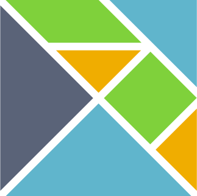
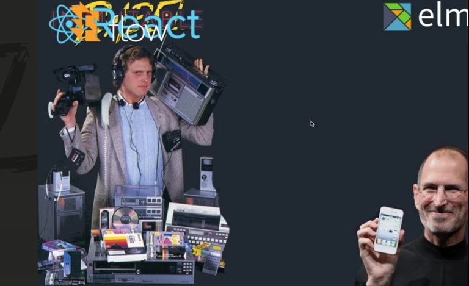
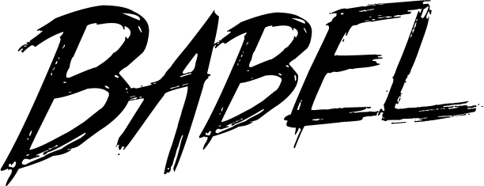
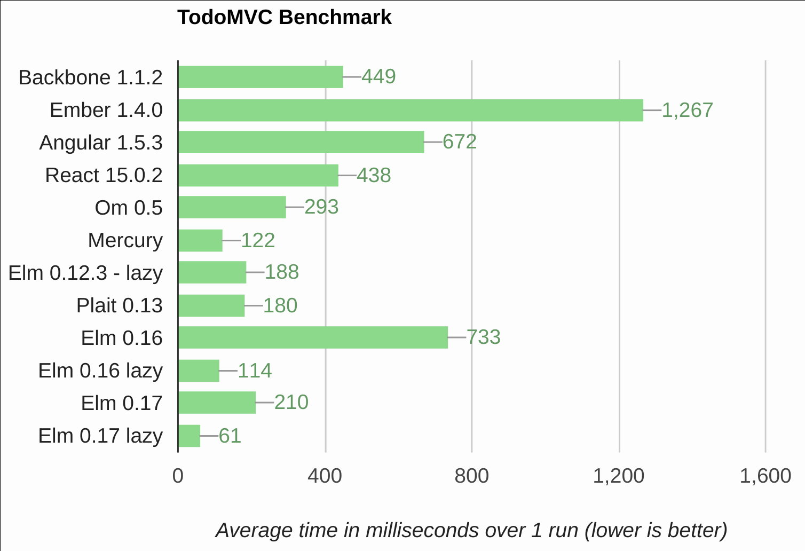

## Did You Get The Message?
### Commanding the Elm Architecture
#### And How Elm Can Help Solve Your Library Overload Problem

<a href="http://elm-lang.org/"></a>

@toastal


* * *


## What is Elm?

Elm is a ~~functional reactive programming language~~ concurrent functional programming language built from the ground up to a be the best language for building UIs.

But before we go more into that…


* * *


## How Did We Get Here?


* * *


<h2></h2>

For better or worse, it changed the game.


- - -


## What failed
### & why did we move on

- State was stored in the DOM
- To get state, we’d requery that DOM
- Querying the DOM is slow
- State had to be stored in the DOM
- Or we’d call an API to get brand new DOM
- No single source of truth


* * *


## ’s `setState`

React’s built-in state management… state no longer tied to the DOM


- - -


## What failed
### & why did we move on

- Somewhat controlled, but ultimately imperative and mutative API
- Performance cost of not using pure render
- Like jQuery, the data is tied to the ‘element’
- Component ‘owning’ data isn’t so cool
- Passing around state/props to components is a bear
- No single source of truth


* * *


## Myriad of  Libraries

A story of stores… data flows one way


- - -


## The real winner here was Redux

- Encourages you not to use local state
- …Ignoring most parts of React and using React just to render stateless components
- Single state atom (the `store`)
- Query stores, never component state

* * *


## Where did  get its inspiration?


* * *


## The Elm Architecture

Literally.


* * *


### The 2016 Front-End Developer Toolkit

| JavaScript               | Elm                     |
| ------------------------ | ----------------------- |
| Babel                    | Elm *(compiler)*        |
| Redux                    | Elm *(design pattern)*  |
| Flow                     | Elm *(type annotation)* |
| Immutable, Ramda, Lodash | Elm *(stdlib)*          |
| React\*                  | html\*                  |
| ESLint                   | elm-format              |
| Mocha, Chai, et.al.      | elm-test                |

\* For rendering virtual DOM (i.e. stateless components) only


* * *





* * *


# Elm Syntax Fly By


- - -


### Literals

```elm
-- Comment
{- Block comment
-}
True  : Bool
32    : number  -- Int or Floatable
2.11  : Float
'x'   : Char
"xyz" : String
"""
Multiline strings
"""   : String
```

- - -

### Lists

```elm
[1, 2, 3]
1 :: [2, 3]
List.range 1 3
```


- - -


### Functions

```elm
toMoney : Float -> String
toMoney dollaz =
    "$" ++ toString dollaz
-- toMoney 3.14
--=> "$3.14"
```

```js
function toMoney(dollaz) {
  return "$" + dollaz
}
// toMoney(3.14)
//=> "$3.14"
```

Note the type signature, implicit return, & JS’s implicit type coercion


- - -


### Union Types (Tagged Union, Enum)

```elm
type Team
    = Mystic
    | Instinct
    | Valor

type Food
    = Vegetable String
    | Fruit String
    | Meat String
    | Grain String
    | Dairy String
    | NotSureIfFood

type Maybe a
    = Just a
    | Nothing
```


- - -


### Case (works like `switch` + more)

```elm
-- maybe : Maybe Int
case maybe of
    Just x ->
        x

    Nothing ->
        0

-- recursive list length
length : List a -> Int
length list =
    case list of
        [] ->
            0

        head :: tail ->
            1 + length tail
```


- - -


### Record + Type Alias

```elm
type alias Point =
    { x : Int
    , y : Int
    }

p : Point
p =
    { x = 0, y = 1 }

p1 : Point
p1 =
    { p | x = 2 }
-- { x = 2, y = 1 }
```


* * *


## 

`elm-make` compiles to ECMAScript 5 so it’s compatible with all the things you care about.


* * *


## 

Elm's a strong statically-typed language with type inference.


- - -


### This fails (so do other things)

```elm
import Html exposing (Html, text)

exclaim : String -> String
exclaim string =
    string ++ "!"

view : String -> Html String
view string =
    text (exclaim string)

main : Html String
main =
    view 42
```


* * *


##  /  /  & Stateless Components

The core library has utility functions for Lists, Arrays, Sets, Dictionaries, Strings, Maybes…

With `Maybe` we never have to worry about `null` or `undefined`.

`elm-html` supports all your virtual DOM needs

*Note: doesn't support higher-kinded polymorphism*


- - -


## Wow it has composition too

```elm
import Html exposing (Html, h2, text)
import String

exclaim : String -> String
exclaim string =
    string ++ "!"

view : List String -> Html String
view =
    let
        heading string = h2 [] [ text string ]
    in
        heading << String.join " " << List.map exclaim

main : Html String
main =
    view ["Hello", "Darkness", "My",  "Old", "Friend"]
```


- - -


## Equality checks? Ha.

```elm
import Html exposing (text)

listA : List (List Int)
listA =
    [[1, 2], [3, 4, 5]]

main =
    [[1, 2], [3, 4, 5]] == listA
        |> toString
        |> text
```


* * *


## What if  was only a design pattern instead of a whole library?


- - -


## The  Architecture (TEA)

```elm
-- Model aka State
init : Model

-- View aka stateless component
-- Sends messages (dispatches actions)
view : Model -> Html Msg

-- Update aka Reducer
-- combines the message (action) and the current model to create
-- a new model for the state
-- Uses unions types and pattern matching
update : Msg -> Model -> Model
```


* * *


## Live  coding???

string reverser + string shouter

```elm
import Html exposing (Html, Attribute, div, input, text)
import Html.App as Html
import Html.Attributes exposing (..)
import Html.Events exposing (onInput)
import String


main : Program Never Model Msg
main =
  Html.beginnerProgram
    { model = init
    , update = update
    , view = view
    }
```


- - -


## The cheat (in case I stumble)

```elm
import Html exposing (Html, Attribute, div, input, text)
import Html.Attributes exposing (..)
import Html.Events exposing (onInput)
import String


type alias Model =
 { reverse : String
 , shout : String
 }


init : Model
init =
  { reverse = ""
  , shout = ""
  }


type Msg
  = Reverse String
  | Shout String


update : Msg -> Model -> Model
update msg model =
  case msg of
    Reverse str ->
      { model | reverse = str }

    Shout str ->
      { model | shout = str }


view : Model -> Html Msg
view { reverse, shout } =
  div []
    [ input [ type' "text", placeholder "Reverse me", value reverse, onInput Reverse ] []
    , div [] [ text <| String.reverse reverse ]
    , input [ type' "text", placeholder "Shout me", value shout, onInput Shout ] []
    , div [] [ text <| String.toUpper shout ]
    ]


main : Program Never Model Msg
main =
  Html.beginnerProgram
    { model = init
    , update = update
    , view = view
    }
```


* * *


## But how easy is it to get  into an existing app?


- - -


##### Run from command line

```bash
elm make src/MyThing.elm --output=my-thing.js
```


##### Something like this is created

```js
var Elm = Elm || {};
Elm.MyThing = {
    embed: function(node) { /* take over the given node */ },
    fullscreen: function() { /* take over the <body> */ },
    worker: function() { /* run the program with no UI (NOT a Web Worker) */ }
};
```


##### Source the script in your HTML

```html
<script type="application/javascript" src="/static/my-thing.js"></script>
```


##### Or import it with whatever in JavaScript

```js
import {Elm} from "my-thing"
```


* * *


### [Benchmark](https://lorenzo.github.io/todomvc-perf-comparison/) (some libraries out of date)




* * *


## Going deeper

- Effects: Commands, Subscriptions (Random # Gen., HTTP/REST, Time, Animation, Web Sockets)
- JSON decoding & URL parsing (via applicative functors)
- Nested Components
- Ports
- Results: Error Handling

[Read the guide](http://guide.elm-lang.org/)


* * *


# Sorry, React
## It’s not that you’re a bad framework…


- - -


## …Some of our best times have been with you…


- - -


## …You’ve taught us a lot about who we are and who we want to be…


- - -


## …But we’ve looked around & we know we can do better.

<a href="http://elm-lang.org/"></a>


* * *


## It’s been real.

# Thanks.

You can follow me on Twitter `@toastal`
